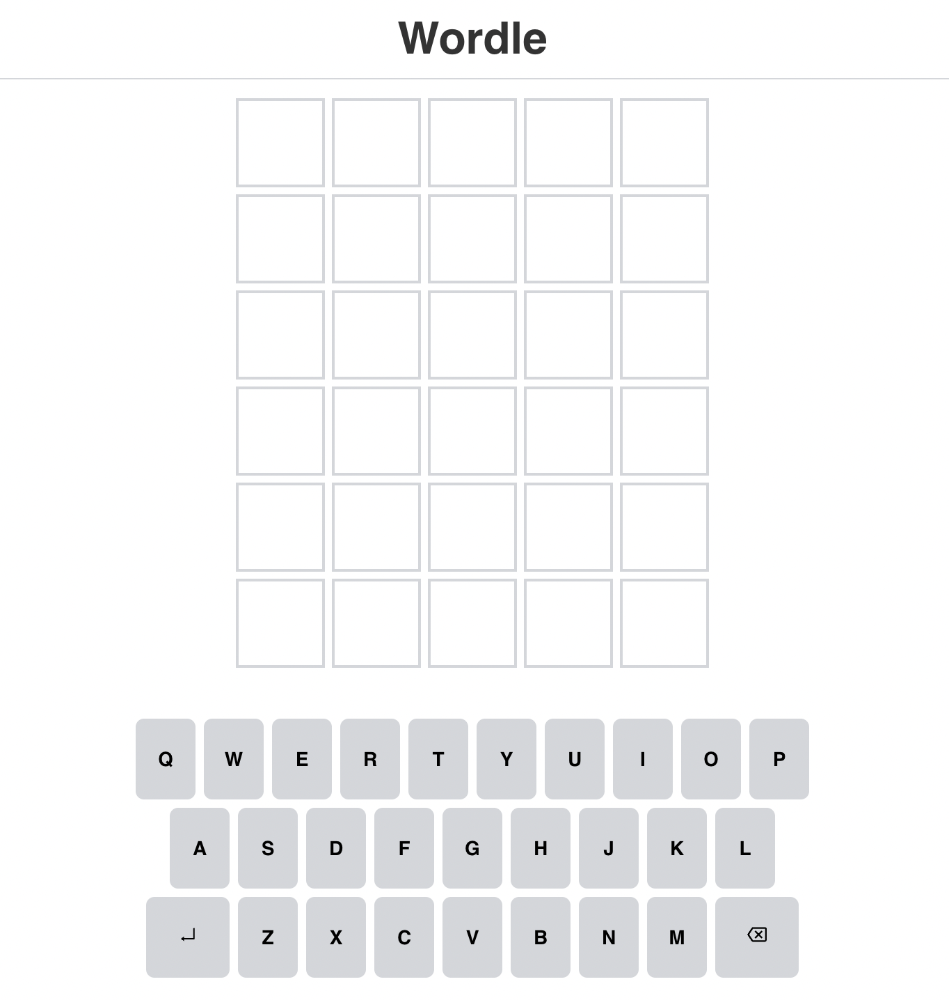

# Wordle

[Wordle Live][worlde]

[worlde]: https://victorguillen.github.io/Wordle/

## Game Play

  - You get 6 tries to solve the game.
  - You can only play once a day.
  - Words cannot be repeated.
  - Word has to be at least 5 characters long.
  - A green colored tile indicates letter is in the right position, a yellow tile indicates a letter belonging to the word but in the wrong positon.

## Controls

  - You can use the keyboard to type and submit with the "enter" key.
  - You can use the mouse to click on the keyboard to select a letter.

## Code

### Persisting the game & daily use

  - The game is persisted using local storage.
  - The game checks for todays date, allowing the game to be played once a day.

  Note: You can clear local storage through the console on the browser to play again. You can also look up the answer through local storage or checking the network tab.

### Game logic

  - I wrote a custom hook to handle the game logic.

### Components

  - App handles fetching the word and checking the date.
  - Wordle adds an event listener for the keyboard, initializes the game by passing the solution to the custom hook, renders the Board, Keyboard and Modal.
  - Board renders each row.
  - Keyboard renders the keyboard to keep track of letters used.
  - Modal pop ups at the end of a game wether you win or loose.

### Animation

  - Flip: flips the tiles when a word is submitted.
  - Bounce: bounces the tile when typing a letter.
  - Shake: shakes tiles when a word submitte fails (word too short or repeated).

